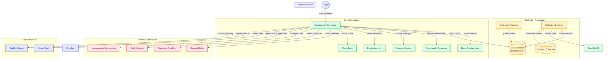

# Graph

```mermaid
flowchart TD

subgraph group_interaction["Player Interaction"]
end

subgraph group_preparation["Collection Preparation"]
  node_collection[("Card Collection<br/>[collection.csv]")]
  node_collection_model["Collection Template"]
  node_enricher["Collection Enricher"]
  node_enriched_data[("Enriched Collection")]
end

subgraph group_generation["Deck Generation"]
  node_generator["Commander Generator"]
  node_configuration["Deck Configuration"]
  node_commander_selection["Commander Selection"]
  node_synergy_scoring["Synergy Scoring"]
  node_deck_assembly["Deck Assembly"]
  node_mana_base["Mana Base"]
end

subgraph group_verification["Analysis Verification"]
  node_bracket_rules["Bracket Rules"]
  node_duplicate_check["Duplicate Checking"]
  node_deck_analysis["Deck Analysis"]
  node_improvement_suggestions["Improvement Suggestions"]
end

subgraph group_outputs["Export Outputs"]
  node_deck_file["Saved Deck"]
  node_deck_export["Decklist Export"]
end

node_player(("Player"))
node_scryfall["Scryfall API"]
node_dropbox["Dropbox"]

node_player -->|"runs generator"| node_generator
node_generator -->|"reads settings"| node_configuration
node_generator -->|"reads cards"| node_collection
node_collection_model -->|"guides format"| node_collection
node_enricher -->|"loads collection"| node_collection
node_enricher -->|"fetches data"| node_scryfall
node_enricher -->|"writes enrichment"| node_enriched_data
node_generator -->|"selects commander"| node_commander_selection
node_generator -->|"scores synergies"| node_synergy_scoring
node_generator -->|"assembles deck"| node_deck_assembly
node_generator -->|"builds mana"| node_mana_base
node_generator -->|"checks bracket"| node_bracket_rules
node_generator -->|"checks duplicates"| node_duplicate_check
node_generator -->|"analyzes deck"| node_deck_analysis
node_generator -->|"generates suggestions"| node_improvement_suggestions
node_generator -->|"saves deck"| node_deck_file
node_generator -->|"exports decklist"| node_deck_export
node_generator -.->|"copies optionally"| node_dropbox

click node_generator "https://github.com/allgoliot/mtg-deckgenpy/blob/main/scripts/commander_generator3.0.py"
click node_configuration "https://github.com/allgoliot/mtg-deckgenpy/blob/main/conf/config.example.yaml"
click node_collection "https://github.com/allgoliot/mtg-deckgenpy/blob/main/data/collection.csv"
click node_collection_model "https://github.com/allgoliot/mtg-deckgenpy/blob/main/models/collection_modele.csv"
click node_enricher "https://github.com/allgoliot/mtg-deckgenpy/blob/main/scripts/enriching_collection.py"
click node_enriched_data "https://github.com/allgoliot/mtg-deckgenpy/tree/main/data"
click node_commander_selection "https://github.com/allgoliot/mtg-deckgenpy/blob/main/scripts/commander_generator3.0.py"
click node_synergy_scoring "https://github.com/allgoliot/mtg-deckgenpy/blob/main/scripts/commander_generator3.0.py"
click node_deck_assembly "https://github.com/allgoliot/mtg-deckgenpy/blob/main/scripts/commander_generator3.0.py"
click node_mana_base "https://github.com/allgoliot/mtg-deckgenpy/blob/main/scripts/commander_generator3.0.py"
click node_bracket_rules "https://github.com/allgoliot/mtg-deckgenpy/blob/main/scripts/commander_generator3.0.py"
click node_duplicate_check "https://github.com/allgoliot/mtg-deckgenpy/blob/main/scripts/commander_generator3.0.py"
click node_deck_analysis "https://github.com/allgoliot/mtg-deckgenpy/blob/main/scripts/commander_generator3.0.py"
click node_improvement_suggestions "https://github.com/allgoliot/mtg-deckgenpy/blob/main/scripts/commander_generator3.0.py"

classDef toneNeutral fill:#f8fafc,stroke:#334155,stroke-width:1.5px,color:#0f172a
classDef toneBlue fill:#dbeafe,stroke:#2563eb,stroke-width:1.5px,color:#172554
classDef toneAmber fill:#fef3c7,stroke:#d97706,stroke-width:1.5px,color:#78350f
classDef toneMint fill:#dcfce7,stroke:#16a34a,stroke-width:1.5px,color:#14532d
classDef toneRose fill:#ffe4e6,stroke:#e11d48,stroke-width:1.5px,color:#881337
classDef toneIndigo fill:#e0e7ff,stroke:#4f46e5,stroke-width:1.5px,color:#312e81
classDef toneTeal fill:#ccfbf1,stroke:#0f766e,stroke-width:1.5px,color:#134e4a
class node_collection,node_collection_model,node_enricher,node_enriched_data toneAmber
class node_generator,node_configuration,node_commander_selection,node_synergy_scoring,node_deck_assembly,node_mana_base,node_scryfall toneMint
class node_bracket_rules,node_duplicate_check,node_deck_analysis,node_improvement_suggestions toneRose
class node_deck_file,node_deck_export,node_player,node_dropbox toneIndigo
```
